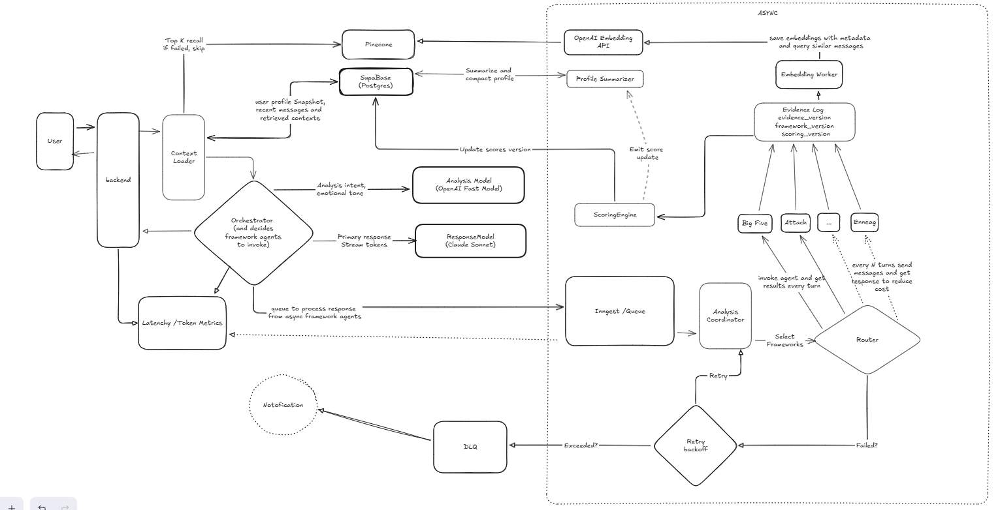

# Part 1: Architecture & Decisions

## Problem 1: Multi-Agent Execution on the Critical Path

### Problem  
The current message flow implies that all **7 framework agents** are invoked synchronously, and their outputs are required before generating a user-facing response.

### Why it matters  

- **Latency**  
  Even with parallel execution, 7 LLM calls make sub-2s P95 latency unrealistic.

- **Cost**  
  Per-turn fan-out scales linearly with usage and quickly becomes economically unsustainable.

- **UX risk**  
  A single slow, degraded, or failed agent can block or degrade the entire response.

### How to address it  

- Remove framework agents from the **synchronous response path**.
- Let the **orchestrator** generate the user response immediately using:
  - conversation context
  - an existing profile summary
- Run all framework agents **asynchronously** (e.g., via Inngest).
- Apply agent outputs only to **future turns**, never the current response.

This preserves UX responsiveness while still allowing deep, ongoing profile enrichment.

---

## Problem 2: Profile Scoring Lacks Provenance, Versioning, and a Single Source of Truth

### Problem  

Framework agents currently emit **direct score deltas** that mutate `framework_scores`, which only stores the *latest* score/confidence per dimension.

There is no provenance linking score changes to:
- specific messages or retrieved context
- model or prompt versions
- framework rules or agent logic

Additionally, regenerating `profileSummary` risks making the summary the **de facto source of truth**, rather than a derived view.

### Why it matters  

- **Un-debuggable**  
  When the system is wrong, you can’t explain why, roll back, or replay with improved prompts.

- **Inconsistency**  
  Contradictions between agents can’t be resolved without a shared substrate of evidence.

- **Low trust**  
  Scores can drift or oscillate without an auditable rationale, undermining user confidence.

### How to address it  

- Introduce an **append-only event model**, for example:

```text
score_events(
  framework,
  dimension,
  delta,
  confidence,
  source_message_id,
  retrieval_ids,
  model,
  prompt_hash,
  timestamp
)

observations(
  atomic_claim,
  evidence_refs,
  confidence,
  source_agent
)

```
 

- Framework agents emit **evidence and observations**, not direct score mutations.

- Introduce a **single scoring engine** that:

    - normalizes updates

    - resolves conflicts

    - applies confidence weighting

    - applies temporal decay

- Compute `framework_scores` as a **materialized view or periodic rollup**, not a write target.

- Store **raw agent output JSON** for full auditability.

- Keep `profileSummary` as a derived cache, regenerable deterministically from events.

This creates a clear, explainable chain from user input → evidence → inference → score.


Here is the diagram.

  